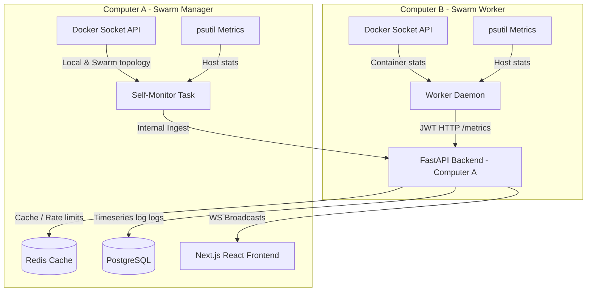
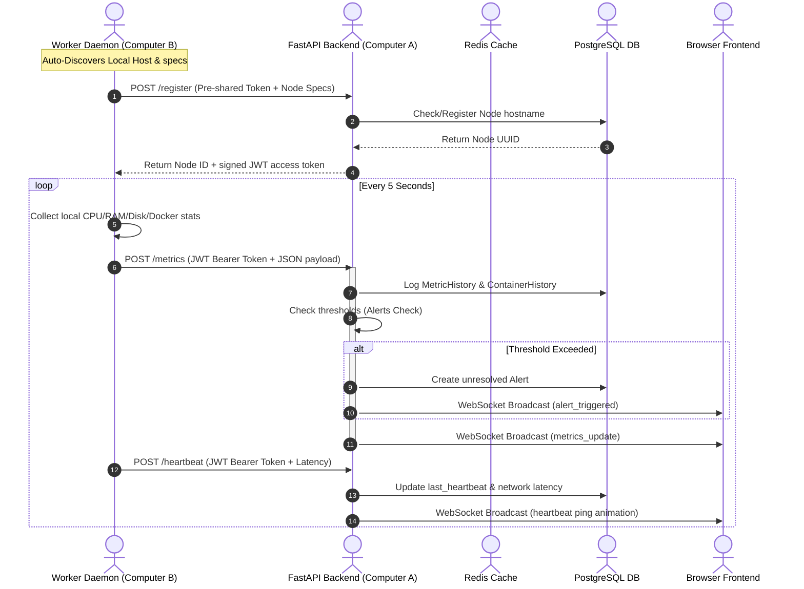

# ClusterDash: Distributed Swarm Monitor

ClusterDash is an industry-quality, real-time distributed Docker cluster monitoring dashboard. It visualizes Docker Swarm architecture, container statuses, alerts, and node telemetry (CPU, memory, disk, network throughput) across physical nodes on a local network.

The project is architected using **Clean Architecture** patterns (specifically the Repository/Adapter pattern) to decouple metric collection from ingestion and consumption. In Phase 1, metrics are gathered from Docker sockets. In Phase 2, this can be swapped to Node Exporter and Prometheus without altering the database schema, backend API routes, or React frontend.

---

## Architecture Diagram



---

## Core Workflows

### Worker Node Registration & Heartbeat Stream



---

## Project Structure

```
clusterdash/
├── backend/
│   ├── app/
│   │   ├── api/          # REST & WS Router Endpoints
│   │   ├── core/         # Settings, Security (JWT), Redis connection, DB engine
│   │   ├── domain/       # Abstractions (MetricSource) & Pydantic Schemas
│   │   ├── adapters/     # Postgres repository & Docker socket adapters
│   │   └── services/     # Alert calculations, WebSocket Manager, Node ingestion
│   ├── main.py           # Application Entrypoint & Monitor Loop
│   ├── requirements.txt  # FastAPI backend dependencies
│   └── Dockerfile
├── worker/
│   ├── daemon.py         # Autonomous monitoring agent running on Worker Nodes
│   ├── requirements.txt
│   └── Dockerfile
├── frontend/
│   ├── src/
│   │   ├── app/          # Next.js Layout and Pages (page.tsx)
│   │   └── components/   # Visual maps, charts, log terminals
│   ├── package.json
│   └── Dockerfile
├── docker-compose.yml    # Development composition (DB, Redis, Backend, Frontend, simulated Worker)
├── docker-compose.swarm.yml # Docker Swarm production deployment stack
└── README.md             # Documentation
```

---

## Setup & Deployment Instructions

### Method 1: Local Development Simulation (Single Machine)

This configuration compiles the backend, frontend, database, and Redis cache, then launches a simulated worker container `clusterdash-worker-sim` running on a separate bridge network that registers itself, allowing you to test the complete multi-node pipeline locally.

1. Ensure Docker and Docker Compose are installed.
2. From the root directory, run:
   ```bash
   docker compose up --build
   ```
3. Access the dashboard:
   - **Frontend UI**: `http://localhost:3000`
   - **FastAPI API Documentation**: `http://localhost:8000/docs`

---

### Method 2: Physical Distributed Deployment (Two Computers)

#### Step 1: Initialize Docker Swarm
On **Computer A** (Manager), run:
```bash
docker swarm init --advertise-addr <COMPUTER_A_IP>
```
*This output will display a join command containing a token: `docker swarm join --token <TOKEN> <COMPUTER_A_IP>:2377`.*

On **Computer B** (Worker), run the join command:
```bash
docker swarm join --token <TOKEN> <COMPUTER_A_IP>:2377
```

#### Step 2: Deploy Infrastructure on Computer A (Manager)
1. Copy the `clusterdash` directory to Computer A.
2. Build the images:
   ```bash
   docker compose -f docker-compose.swarm.yml build
   ```
3. Deploy the Swarm stack:
   ```bash
   docker stack deploy -c docker-compose.swarm.yml clusterdash
   ```
This launches Postgres, Redis, the Backend, and the Frontend on the manager node.

#### Step 3: Start the Daemon on Computer B (Worker)
1. Copy the `worker/` folder to Computer B.
2. Start the daemon script locally on the worker machine:
   ```bash
   export BACKEND_URL=http://<COMPUTER_A_IP>:8000
   export REGISTRATION_TOKEN=clusterdash-worker-secret-token
   export HEARTBEAT_INTERVAL=5
   export NODE_ROLE=worker
   
   python3 -m venv venv
   source venv/bin/activate
   pip install -r requirements.txt
   python daemon.py
   ```
3. The daemon automatically queries its local hardware stats and Docker engine API, registers with the manager, receives its JWT token, and streams metrics back to Computer A.

---

## Phase 2: Node Exporter Migration Guide

In Phase 2, directly reading container telemetry via Docker stats will be deprecated. Instead, Prometheus Node Exporter will gather system-level metrics on every machine.

### Decoupled Metric Gathering Interface

We use an adapter pattern to implement `MetricSource`:
```python
# app/domain/interfaces.py
from abc import ABC, abstractmethod
from typing import Dict, Any, List

class MetricSource(ABC):
    @abstractmethod
    def get_node_metrics(self) -> Dict[str, Any]:
        """Reads host OS telemetry (CPU, RAM, Disk, Net)."""
        pass

    @abstractmethod
    def get_container_metrics(self) -> List[Dict[str, Any]]:
        """Reads container status metadata."""
        pass
```

### Steps to Migrate

1. **Install Node Exporter**:
   Install Prometheus Node Exporter on all physical machines. By default, it exports system hardware metrics at `http://localhost:9100/metrics`.

2. **Modify the Dependency Injector**:
   Update the metric collection adapter in the backend or worker configurations. Swap `DockerSwarmAdapter` with `NodeExporterAdapter`:
   ```python
   # app/core/dependencies.py (or main.py startup configuration)
   from app.adapters.metrics.node_exporter_adapter import NodeExporterAdapter

   def get_active_metrics_adapter() -> MetricSource:
       # Phase 1:
       # return DockerSwarmAdapter()
       
       # Phase 2 (Scrapes Node Exporter for host stats + Docker socket for metadata):
       return NodeExporterAdapter(node_exporter_url="http://localhost:9100/metrics")
   ```

Because both adapters serialize their metrics into the standard domain models (`NodeMetricPayload` and `ContainerMetric`), the REST API routes, Postgres database schema, alerts engine, WebSockets, and Next.js frontend **require zero code modifications**. The dashboard UI remains identical.
